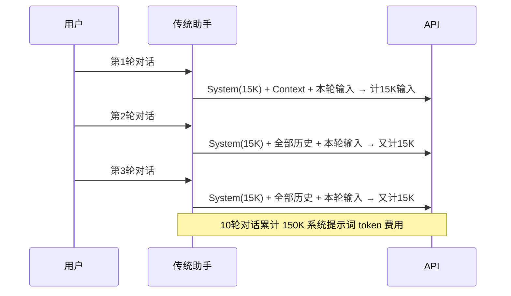
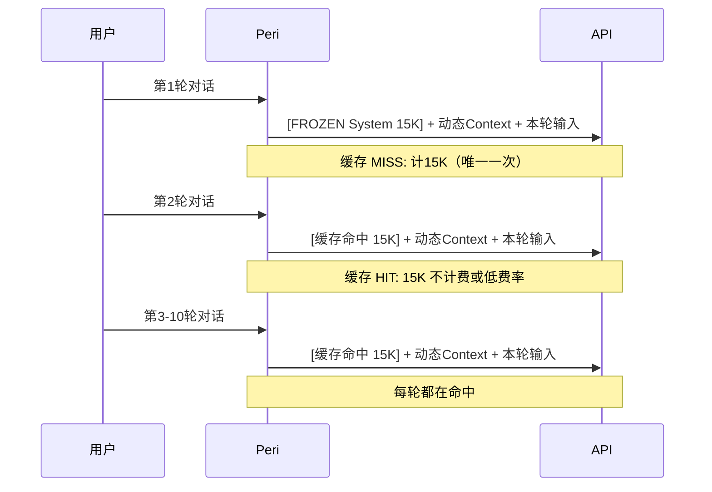
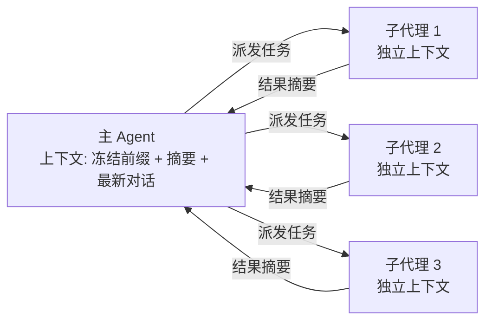

import { Aside } from '@astrojs/starlight/components';

## 为什么上下文重要

大语言模型的注意力机制存在 **n² 的复杂度关系**：输入序列长度翻倍，注意力计算量翻四倍。更关键的是，token 越多，模型的注意力越稀释——"长上下文"不等于"好理解"。

### 长上下文的隐性成本

| 维度 | 短上下文（~10K tokens） | 长上下文（~100K tokens） |
|------|------------------------|--------------------------|
| API 延迟 | 1-3 秒 | 5-15 秒 |
| 输入费用 | 低 | token 数 × 单价 |
| 注意力质量 | 精准，关键信息密度高 | 稀释，模型可能"遗忘"中间部分 |
| 缓存命中 | 维护简单 | 缓存碎片化，命中率下降 |

**核心思路：把上下文当作有限资源管理，而非无限垃圾桶。**

Peri 的设计哲学就是帮你管理这一资源——系统提示词冻结缓存、按需文件加载、自动压缩、子代理隔离——全是为了用最少的 token 传达最精准的信息。

## Peri 的冻结前缀缓存

### 传统方式的问题

传统 AI 编码助手每次请求都发送完整的系统提示词。一个典型的编码助手系统提示词可能占用 8K-15K tokens——每次 `/turn` 都原样发送，这些 8K-15K token 反复计费。



### Peri 的冻结前缀方案

Peri 利用 Anthropic 的 Prompt Caching API，将系统提示词（包括 CLAUDE.md、skill 上下文、hook 指令等）作为**冻结前缀（frozen prefix）**缓存。这些 token 在会话生命周期内不变，95-99% 的对话 token 从缓存命中，不计费或按缓存价格计费。



### 实际效果

以一个 15K tokens 的冻结前缀为例：

| | 传统方式（10轮） | Peri（10轮） |
|---|---------------|------------|
| 系统提示词 token 计费 | 150K | 15K |
| 缓存命中率 | 0% | 95-99% |
| 等效节省 | — | ~90% |

冻结前缀中的内容不会被压缩（compaction）修剪——它们是"永久上下文"。因此，写入 CLAUDE.md 的内容是真正的"免费指令"（仅首次收取缓存写入费）。

<Aside type="note">
  冻结前缀在什么时候失效？当模型切换、系统提示词变更或 <code>/clear</code> 重置会话时。日常对话中前缀高度稳定，这也是为什么保持 CLAUDE.md 精简很重要——每一行都留在前缀里。
</Aside>

## CLAUDE.md 的上下文工程视角

CLAUDE.md 不是文档 dump，而是**浓缩指令**——它占据冻结前缀，每次会话都要携带。你的每个字都在决定 Peri 将注意力分配到何处。

### 好的 CLAUDE.md vs 差的 CLAUDE.md

**差的设计（信息 dump）：**

```markdown
# 项目说明
本项目是一个用 Rust 编写的终端 AI 编码助手。使用 tokio 异步运行时，
ratatui 作为 TUI 框架，clap 处理命令行参数。项目结构分为 agent、
tui、tools、mcp 等模块。agent 负责 ReAct 循环，tui 负责界面渲染，
tools 负责工具定义和执行，mcp 负责与外部 MCP 服务器通信...
（继续 200 行项目介绍）
```

Peri 加载进来全是描述性信息，没有一个指令告诉它"该怎么做"。

**好的设计（浓缩指令）：**

```markdown
# 编码规范
- 禁止 println!，统一用 tracing（info/warn/error）
- CJK 截断用 chars().take()，禁止 bytes().take()
- 错误处理统一用 anyhow::Result，禁止裸 unwrap()

# 模块速查
| 模块 | 入口 | 关键规则 |
|------|------|----------|
| peri-agent | agent.rs | 中间件顺序不可变 |
| peri-mcp | client.rs | 连接超时 5 秒 |

# TRAP
- [TRAP] Windows 路径含反斜杠导致 glob 失败 → 统一 normalize 后再 glob
```

每一行都是可执行指令，Peri 不需要从中"提取信息"——直接遵守。

### 用 @ 引用拆分大文件

主 CLAUDE.md 放全局规则，细节用 `@` 引用按需展开：

```markdown
# 项目根 CLAUDE.md（< 50 行）
@.claude/rules/coding-style.md
@.claude/rules/testing.md
```

被引用的文件也参与冻结前缀缓存，但在文件层面分离，方便维护。Peri 自身的 CLAUDE.md 就是这样做的大约 200 行主文件引用规则文件。

<Aside type="tip">
  <code>@</code> 引用文件的内容和直接写在主文件中效果相同——都进入冻结前缀。区别在于文件隔离降低了维护心智负担。不要在引用的文件里写"冗余摘要"——上下文已经包含信息源，写摘要就是浪费。
</Aside>

## 自动压缩

当对话历史接近模型的 token 限制时，Peri 触发自动压缩（compaction）。压缩器遍历对话历史，将已完成的操作总结为结构化摘要，丢弃原始的工具调用细节。

### 压缩事件

`PreCompact` 事件在压缩前触发——你可以通过 hook 在压缩前备份关键信息，或注入指令指定哪些内容必须保留。

`PostCompact` 在压缩后触发——验证压缩结果是否丢了关键上下文。

```json
{
  "hooks": {
    "PreCompact": [
      {
        "matcher": "",
        "hooks": [
          {
            "type": "command",
            "command": "echo 'compaction开始' >> /tmp/peri-compaction.log"
          }
        ]
      }
    ]
  }
}
```

### 在 CLAUDE.md 中指定压缩保留内容

Peri 的压缩算法会优先保留 CLAUDE.md 中声明的关键信息。在文件末尾添加 "Summary instructions" 段落：

```markdown
## Summary instructions
压缩时保留以下信息：
- 所有 TRAP 标记（硬约束）
- 当前任务的目标和验收条件
- 最近 3 轮工具调用结果的摘要
- 修改过的文件列表（不要保留完整 diff）
```

压缩后，Peri 的上下文变成一个"精简摘要 + 冻结前缀 + 最新几轮对话"的结构，既保留了项目知识，又释放了空间继续推理。

## 渐进式信息加载

Peri 不会在会话开始时把所有项目文件读进上下文。它的工作方式是：

1. **收到任务** → 分析需求
2. **用 glob 发现文件** → 只获取匹配的文件路径
3. **用 grep 定位代码** → 只读取匹配行附近的上下文
4. **按需 Read** → 只在需要完整内容时读取整个文件

每一步都只向上下文添加最少的信息。

```mermaid
flowchart TD
    T[任务: 修改用户认证逻辑] --> G[glob: **/auth*]
    G --> GR[grep: verify_token | login | authenticate]
    GR --> R[Read: 仅读匹配文件中的相关函数]
    R --> E[Edit: 精确修改]
    E --> V[验证: cargo check]
```

### 工具结果也是 token 高效的

Peri 的工具输出自动截断——过长的 grep 结果、文件内容会被压缩为摘要。你不需要手动限制工具范围，Peri 内置了输出裁剪机制。

<Aside type="note">
  如果 Peri 反复读取同一个大文件，说明它没有从先前的上下文中保留关键信息——此时应将该文件的模块索引加入 CLAUDE.md，让 Peri 知道"去哪里找什么"，而非依赖上下文中的文件内容。
</Aside>

## 子代理隔离

每个子代理拥有独立的上下文窗口，不会污染主对话。



这意味着：
- 子代理执行过程中产生的大量搜索和读取不会挤占主对话的上下文
- 主 Agent 收到的是子代理的**结构化摘要**，而非原始工具调用日志
- 可以并行搜索多个代码区域而不互相干扰

子代理适合处理"搜索-分析-总结"类的密集型任务——它们吃掉 token，但只向主 Agent 返回提炼后的结论。

## 长任务策略

长时间任务（如重构 20 个模块、批量迁移测试）面临 token 积累问题。三种处理策略：

### 策略 1：压缩 + 结构化笔记

Peri 在压缩时会保留"结构化笔记"——你可以在任务开始前让 Peri 建立笔记文件：

```
在 notes/task-log.md 中创建任务日志。每完成一个模块，
记录：模块名、改动摘要、验证结果。压缩时优先保留此文件的内容。
```

压缩后 Peri 通过笔记文件恢复上下文，而非依赖对话历史。

### 策略 2：子代理架构

将长任务拆成独立子代理，每个子代理处理一个相对独立的子任务。子代理完成后返回结果摘要，主 Agent 负责编排。

```
主 Agent：编排重构流程
  ├── 子代理 1：重构 src/models/（独立上下文，完成即返回摘要）
  ├── 子代理 2：重构 src/services/（独立上下文）
  └── 子代理 3：更新测试（独立上下文）
```

子代理的内部对话历史在完成后销毁——主 Agent 只留下三份摘要。

### 策略 3：Combine

两种策略可以组合：让每个子代理在自己的上下文中使用压缩，处理更大的子任务。主 Agent 用笔记文件协调全局状态。

## 实用建议

**拆分大任务。** 一句"重构整个项目"会让 Peri 在单一上下文中同时处理几百行新老代码对比——注意力崩了。拆成"先重构模块 A → 验证 → 再重构模块 B"。

**精简你的 CLAUDE.md。** 每季度回顾一次——哪些规则 Peri 已经不再需要？哪些描述可以用 @ 引用拆出去？过了 200 行就考虑重构。

**主动 `/compact`。** 不等到自动触发。当对话超过 15 轮时，主动执行 `/compact` 释放空间。压缩后确认 Peri 仍理解任务目标再继续。

**给 Peri 明确的"当前关注点"。** 每次 `/clear` 或 `/compact` 后的第一条消息，先重申当前任务的目标和进度：

```
（续）当前在重构 auth 模块，已完成：
- JWT 签发逻辑迁移 ✓
- 中间件提取 ✓
下一步：迁移 refresh token 逻辑
```

这让 Peri 不需要从上下文中"猜测"当前状态。

**分批改，分批交。** 30 个文件的重构，不要一个 commit 搞定。每改 5-8 个文件，验证通过就 commit。如果某个批次出问题，损失可控，`/clear` 后也很容易恢复。

<Aside type="caution">
  接近 token 限制时 Peri 的输出质量会下降——不是模型能力的问题，而是注意力被长历史稀释。如果你发现 Peri 开始忽略指令或"忘记"几分钟前的决定，主动 <code>/compact</code> 或 <code>/clear</code>。
</Aside>
