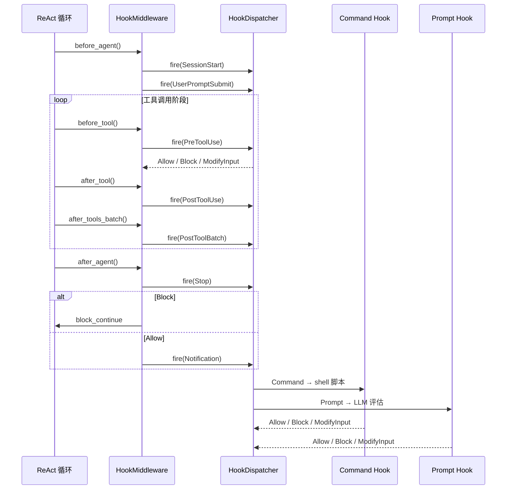

import { Aside } from '@astrojs/starlight/components';

## 什么是 Hooks

Hooks（钩子）是事件驱动的自动化机制，与 Claude Code 生态完全兼容。它在 Agent 生命周期的关键节点——比如开始一轮推理前、工具调用后、子代理（Subagent）启动时——自动执行一段脚本、发起 HTTP 请求或注入一条指令。

和 CI/CD pipeline 的 hook 类似，但触发点是 Agent 的行为事件而非 git 事件。你可以用 hooks 来格式化代码、发送通知、校验工具参数，或强制注入项目规范——这些都是确定的自动化行为，不依赖 LLM 自行决策。

<Aside type="tip">
  Hooks 提供确定性控制。需要 LLM 判断才能决定执行是否继续的场景，请使用 <code>prompt</code> 或 <code>agent</code> 类型 hook，它们会调用模型来评估条件。
</Aside>

## 可用事件

Peri 实现了 Claude Code 的完整 hook 事件集。以下是对齐中间件链（middleware chain）的核心事件：

| 事件 | 触发时机 | 典型用途 |
|------|---------|---------|
| `UserPromptSubmit` | 用户提交消息时，Agent 处理之前 | 注入项目规范、修改 prompt |
| `PreToolUse` | 工具调用执行前 | 校验参数、阻止危险操作 |
| `PostToolUse` | 工具调用成功后 | 格式化输出、记录日志 |
| `PostToolUseFailure` | 工具调用失败后 | 错误通知、重试判断 |
| `PostToolBatch` | 一批并行工具调用全部完成后 | 批量后处理 |
| `PermissionRequest` | 权限弹窗出现时 | 自动审批、录音提醒 |
| `Stop` | Agent 本轮推理结束后 | 通知用户、后续处理 |
| `StopFailure` | 本轮因 API 错误结束时 | 错误上报、降级策略 |
| `SubagentStart` | 子代理启动时 | 播放提示音、日志记录 |
| `SubagentStop` | 子代理完成时 | 通知、汇总结果 |
| `SessionStart` | 会话开始或恢复时 | 环境检查、加载配置 |
| `SessionEnd` | 会话结束时 | 清理临时文件、归档 |
| `PreCompact` | 上下文压缩前 | 备份关键信息 |
| `PostCompact` | 上下文压缩后 | 验证压缩结果 |
| `Notification` | Agent 等待用户输入时 | 桌面通知、IM 推送 |

事件的大致时序：`SessionStart` → `UserPromptSubmit` → (推理循环: `PreToolUse` → `PostToolUse` | `PostToolUseFailure` → `PostToolBatch`) → `Stop` | `StopFailure` → `SessionEnd`。



## 配置方式

Hooks 通过 `.claude/settings.json`（项目级）或 `~/.claude/settings.json`（全局）中的 `hooks` 字段配置，完全兼容 Claude Code 格式。

### 基本结构

一个 hook 配置包含三个层级：事件名 → 匹配器组 → hook 列表。匹配器（matcher）用于按工具名或模式筛选触发条件，为空字符串表示匹配所有。

```json
{
  "hooks": {
    "PostToolUse": [
      {
        "matcher": "Edit|Write",
        "hooks": [
          {
            "type": "command",
            "command": "jq -r '.tool_input.file_path' | xargs npx prettier --write"
          }
        ]
      }
    ],
    "Notification": [
      {
        "matcher": "",
        "hooks": [
          {
            "type": "command",
            "command": "osascript -e 'display notification \"Peri needs your attention\" with title \"Peri\"'"
          }
        ]
      }
    ]
  }
}
```

### 配置层级

Peri 按以下优先级加载 hooks，后加载的会追加到列表中：

1. **插件 hooks**：插件声明中自带的 hooks
2. **全局 hooks**：`~/.claude/settings.json` 或 `~/.peri/settings.json`
3. **项目 hooks**：`<project>/.claude/settings.local.json`

## Hook 类型

Peri 支持四种 hook 执行类型，对齐 Claude Code 的 `HookType` 定义。

### Command（Shell 命令）

最常用的类型。Peri 通过 stdin 传入 JSON 格式的事件上下文（session_id、cwd、tool_name 等），执行指定的 shell 命令。

```json
{
  "type": "command",
  "command": "python3 ~/.claude/hooks/scripts/hooks.py",
  "timeout": 5000
}
```

命令通过 stdin JSON 获取事件上下文：

```json
{
  "session_id": "abc123",
  "transcript_path": "/path/to/transcript.json",
  "cwd": "/path/to/project",
  "permission_mode": "hitl",
  "hook_event_name": "PreToolUse",
  "tool_name": "Bash",
  "tool_input": { "command": "rm -rf /" }
}
```

- `timeout`：超时毫秒数，默认 5000
- `status_message`：TUI 状态栏显示的执行中提示
- `once`：整个会话生命周期内只触发一次
- `async` + `asyncRewake`：异步执行，完成后可唤醒 Agent 继续推理

### Prompt（LLM 评估）

使用指定模型对上下文进行判断，常用于需要 LLM 决策的场景。模型在 hook 内评估条件并返回结构化决策。

```json
{
  "type": "prompt",
  "prompt": "判断这个工具调用是否安全。如果不安全，返回 {\"decision\": \"block\", \"reason\": \"...\"}",
  "model": "claude-sonnet-4-20250514",
  "timeout": 10000
}
```

Prompt 类型 hook 返回的决策可以阻断工具调用（返回 `"block"` 或 `"ask"`）或修改输入参数。

### HTTP

向指定 URL 发送 POST 请求，body 为事件上下文 JSON。适合对接外部服务，如企业微信通知、飞书机器人、Slack webhook。

```json
{
  "type": "http",
  "url": "https://hooks.slack.com/services/xxx",
  "headers": { "Content-Type": "application/json" },
  "timeout": 5000
}
```

- `allowed_env_vars`：白名单环境变量，用于 URL 中的密钥引用（如 `$SLACK_WEBHOOK_URL`），防止 SSRF 攻击暴露其他环境变量

### Agent（子代理执行）

启动一个完整的 Agent 循环（最多 50 轮）来执行 hook 逻辑。和 Subagent 类似，但由 hook 系统调度和管理。

```json
{
  "type": "agent",
  "prompt": "检查本次工具调用的结果，如果发现安全问题，输出警告",
  "timeout": 30000,
  "once": true
}
```

## 匹配器（Matcher）

`matcher` 字段支持正则表达式，用于按工具名筛选。Peri 会在触发 hook 前将事件上下文 JSON 序列化，然后与 matcher 进行 regex 匹配——典型用法是按 `tool_name` 过滤。

```json
// 只匹配 Bash 和 Write 工具
{ "matcher": "Bash|Write" }

// 匹配所有 Edit 操作
{ "matcher": "Edit" }

// 空字符串表示匹配所有
{ "matcher": "" }
```

## 实际示例

### 桌面通知

当 Agent 等待用户操作时发送 macOS 系统通知：

```json
{
  "hooks": {
    "Notification": [
      {
        "matcher": "",
        "hooks": [
          {
            "type": "command",
            "command": "osascript -e 'display notification \"Peri 需要你的关注\" with title \"Peri\"'"
          }
        ]
      }
    ]
  }
}
```

### 代码格式化

每次文件写入后自动运行 Prettier：

```json
{
  "hooks": {
    "PostToolUse": [
      {
        "matcher": "Edit|Write",
        "hooks": [
          {
            "type": "command",
            "command": "python3 -c \"import json,sys,os; d=json.load(sys.stdin); p=d.get('tool_input',{}).get('file_path',''); os.system(f'npx prettier --write {p}') if p else None\""
          }
        ]
      }
    ]
  }
}
```

### 子代理完成提示音

子代理完成时播放音频文件，提醒用户注意结果：

```json
{
  "hooks": {
    "SubagentStop": [
      {
        "matcher": "",
        "hooks": [
          {
            "type": "command",
            "command": "afplay ~/.claude/hooks/sounds/subagentstop/complete.wav"
          }
        ]
      }
    ]
  }
}
```

### 危险工具拦截

在 Bash 和 Write 工具执行前进行安全校验：

```json
{
  "hooks": {
    "PreToolUse": [
      {
        "matcher": "Bash|Write",
        "hooks": [
          {
            "type": "prompt",
            "prompt": "判断以下工具调用是否安全。`rm -rf`、`git push --force`、覆盖系统文件等操作应判定为危险。返回 JSON：{\"decision\": \"block\"|\"allow\", \"reason\": \"...\"}",
            "timeout": 10000
          }
        ]
      }
    ]
  }
}
```

<Aside type="caution">
  Prompt 类型 hook 会消耗模型 token。对于简单的模式匹配，优先使用 <code>matcher</code> + <code>command</code> 类型，避免不必要的 LLM 调用。
</Aside>

## 查看 Hook 状态

在 Peri TUI 中输入 `/hooks` 打开 Hooks 面板。面板列出所有事件及其已配置的 hook 数量，选中事件可查看每个 hook 的详细信息（类型、匹配器、来源文件、命令）。

<Aside type="note">
  Hooks 面板为只读模式。添加、修改或删除 hooks 需要通过编辑 settings JSON 文件完成。
</Aside>

## 安全性

- **SSRF 防护**：HTTP hook 的 `allowed_env_vars` 白名单机制限制 URL 中可引用的环境变量，防止密钥泄露
- **权限门控**：部分 hook（如 `PreToolUse` 中返回 `block`）会影响工具执行的权限门控（permission gate）
- **Stop block guard**：`Stop` 和 `StopFailure` hook 的连续触发有保护机制，防止 hook 本身出错导致无限循环
- **异步安全**：`async` 类型 hook 完成后可选择是否唤醒 Agent（`asyncRewake`），避免意外打断推理流程

## 与 Claude Code 的兼容性

Peri 的 hooks 系统完全兼容 Claude Code hooks 生态。你的 Claude Code hooks 配置（settings.json 格式）可以直接在 Peri 中使用，无需修改。Peri 还额外支持：

- **Agent 类型 hook**：完整的子代理执行，不只限于 Claude Code 的 stop hook
- **Prompt 注入**：Prompt 类型 hook 的决策结果可以注入到 Agent 的下一步推理中
- **插件 hooks**：插件可以在安装时声明 hooks，无需手动配置
