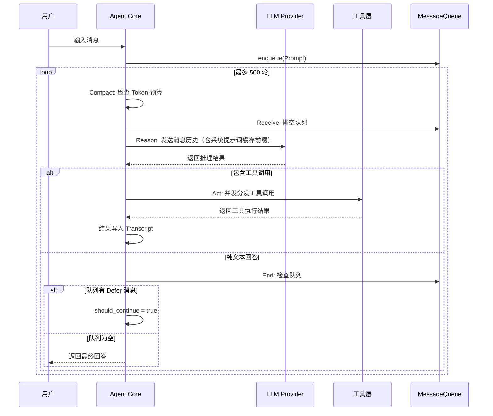

import { Aside, Tabs, TabItem, Card, CardGrid } from '@astrojs/starlight/components';

## 代理循环（Agent Loop）

Peri 的核心是 **ReAct（Reasoning + Acting）循环**——一个持续运行的 receive → evaluate → execute → feedback 闭环。Agent 在循环中交替进行"思考"与"行动"，直到任务完成或触发上限。

```
before_agent → loop(max 500 轮):
  Compact → Receive → Reason → Act → End
```

| 阶段 | 职责 | 关键行为 |
|------|------|---------|
| **Compact** | 上下文压缩 | 检查 Token 预算使用率，超出阈值自动触发 Micro / Full 压缩 |
| **Receive** | 消息接收 | 排空 MessageQueue，将 Prompt / Defer 消息写入 Transcript |
| **Reason** | LLM 推理 | 将消息历史发送给 LLM，获取推理结果（工具调用或文本回答） |
| **Act** | 工具分发与执行 | 解析工具调用、并发执行、收集结果、触发中间件钩子 |
| **End** | 循环控制 | 检查队列是否有新消息——有则 `should_continue=true`，否则退出 |

入口函数：`run_react_loop(context: StageContext, max_iterations: usize)`，位于 `peri-agent/src/agent/stages/mod.rs`。上限 500 轮防止死循环。退出条件：LLM 输出纯文本回答且 MessageQueue 中无待处理唤醒消息。

### 时序图



<Aside type="note">
  MessageQueue 是 Agent 的异步消息通道。后台子代理完成、Cron 触发、Goal 续跑等事件通过 Defer 消息唤醒循环——Agent 不是"一问一答"，而是持续运行的自主系统。
</Aside>

## 消息类型

Peri 内部使用四种消息类型在 Agent 循环中传递信息：

| 消息类型 | 角色 | 生命周期 | 说明 |
|---------|------|---------|------|
| **SystemMessage** | system | 会话启动时构造，整个会话不变 | 系统提示词，分静态段和动态段。包含 `init` 和 `compact_boundary` 两种子类型 |
| **AssistantMessage** | assistant | 每轮 Reasoning 后产生 | LLM 的推理输出：文本回答（纯文本）或工具调用（tool_calls 数组） |
| **UserMessage** | user | 工具执行后产生 | 工具执行结果的载体。格式：`toolu_bdrk_01...` 前缀的 tool_use_id 关联到对应的工具调用 |
| **ResultMessage** | tool | 工具执行完毕产生 | 工具返回值，与 UserMessage 不同——ResultMessage 是内部存储格式，UserMessage 是发送给 LLM 的格式 |

消息通过 `MessageTranscript` 持久化到 SQLite，支持会话恢复时完整重建对话历史。

### SystemMessage 子类型

SystemMessage 有两种子类型，通过 `compact_boundary` 标记区分：

```text
[静态段：角色定义、工具列表、Skills 摘要、CLAUDE.md]
    ↓ 冻结前缀缓存命中 —— 95-99% 不消耗推理时间
__SYSTEM_PROMPT_DYNAMIC_BOUNDARY__
[动态段：对话历史、工具调用结果、上下文信息]
    ↓ 每轮重新计算
```

- **init**：会话首次创建时生成，包含完整的静态段和初始动态段
- **compact_boundary**：Full Compact 压缩后注入，替换旧的摘要内容，保持静态段不变

<Aside type="caution">
  中途注入指令必须使用 <code>UserMessage</code>，不要创建新的 <code>SystemMessage</code>——后者会被 hoist 到系统提示词区域，改变静态段结构，破坏 prompt cache。
</Aside>

## 工具系统

Peri 内置 **12 个核心工具** + **2 个 Meta 工具** + 动态注册的 **Deferred 工具**。工具按类别组织：

| 类别 | 工具 | 说明 |
|------|------|------|
| **文件操作** | Read, Write, Edit | 读文件 / 写文件（原子写入）/ 基于 old_string 的精确替换 |
| **文件搜索** | Glob, Grep | 文件名模式匹配 / 内容正则搜索 |
| **Shell 执行** | Bash | Shell 命令执行，支持超时控制和后台运行 |
| **Web** | WebSearch, WebFetch | 搜索引擎查找 / 网页内容抓取 |
| **编排** | Agent, TodoWrite | 子代理委派 / 多步骤任务追踪 |
| **交互** | AskUserQuestion | 向用户发起结构化提问 |

### 三层分发架构

核心思路：常用工具始终可见，生僻工具按需加载——减少发给 LLM 的工具列表体积，保护 prompt cache。

| 层级 | 数量 | 可见性 | 注册时机 |
|------|------|--------|---------|
| **Core** | 12 个 | 始终发送给 LLM | 编译时注册 |
| **Meta** | 2 个 | 始终发送给 LLM | 编译时注册 |
| **Deferred** | 动态 | 不可见，通过 SearchExtraTools 按需发现 | 运行时动态注册 |

- **Core 工具**：覆盖 90%+ 场景——文件读写、代码搜索、Shell 执行、Web 访问
- **Meta 工具**（`SearchExtraTools`, `ExecuteExtraTool`）：LLM 需要 Core 之外的工具时，先搜索已注册的 Deferred 工具，再代理执行
- **Deferred 工具**：MCP 服务器工具、Cron 定时工具、Workflow 工作流工具、LSP 工具、Plugin 插件工具等

判定逻辑：如果工具名不在 `CORE_TOOLS` 中且不在 `META_TOOLS` 中，则为 Deferred Tool。

### 工具注册

工具通过 `BaseTool` trait 注册：

```rust
#[async_trait]
pub trait BaseTool {
    fn name(&self) -> &str;
    fn description(&self) -> &str;
    fn parameters(&self) -> serde_json::Value;
    fn aliases(&self) -> Vec<&str> { vec![] }
    async fn execute(&self, input: serde_json::Value) -> Result<ToolResult>;
}
```

别名（如 `Bash` 也可写作 `Shell`、`Terminal`）使 LLM 的不同输出都能正确路由到目标工具。

## 上下文管理

### 冻结前缀缓存

Peri 的缓存策略是**性能的核心优势**——也是它和 Claude Code 最大的架构差异之一。

1. **编译时**：系统提示词的静态部分被序列化为固定字节序列
2. **运行时**：每个 API 请求复用已缓存的提示词前缀，`__SYSTEM_PROMPT_DYNAMIC_BOUNDARY__` 标记切分可缓存 / 增量区域
3. **效果**：第 1 次对话建立缓存，第 2+ 次对话只发送增量内容——前缀从 Provider 缓存命中

```text
传统方式: 每次对话重新发送全部上下文 → 100% 新 token
Peri 方式:  冻结前缀 + 增量更新         → 1-5% 新 token
```

<Aside type="tip">
  对于重度用户（每天数百次对话），缓存命中可以降低 90% 以上的 token 消耗——这直接影响 API 费用。
</Aside>

### 自动压缩（Compact）

随着对话增长，消息历史会逼近 LLM 上下文窗口上限。Compact 阶段在每轮迭代开始前检查使用率：

| 使用率 | 策略 | 行为 |
|--------|------|------|
| &lt; 70% | 跳过 | 无需压缩 |
| 70% – 85% | **Micro Compact** | 轻量级——标记较早消息为 `truncated`，不调用 LLM，不消耗 token |
| ≥ 85% | **Full Compact** | 全量压缩——调用独立的 compact LLM 生成摘要，重注入 Transcript，原始消息标记为 `excluded` |

Full Compact 生成的摘要是 `compact_boundary` 类型的 SystemMessage，替换旧摘要位置但保持静态段不变——缓存不受影响。

### CLAUDE.md 自动加载

Peri 在会话启动时扫描 `CLAUDE.md` 文件，将其内容冻结在系统提示词的静态段中。这意味着 **CLAUDE.md 的内容享受 prompt cache 加速**——写在这里的指令不会增加每轮推理成本。

加载优先级（后加载的覆盖前面的）：

1. `~/.claude/CLAUDE.md`（全局，低优先级）
2. `项目根/.claude/CLAUDE.md`（项目级，中优先级）
3. `项目根/CLAUDE.md`（项目级，高优先级）
4. `项目根/子目录/CLAUDE.md`（子目录按需加载，最高优先级）

### Just-in-Time 文件读取

Peri 不会在启动时扫描整个项目。它通过 **Glob + Grep 按需查找**——只在需要时搜索文件系统。这避免了大型代码库的启动延迟，也避免向 LLM 发送无关上下文。

## 会话管理

### 持久化

所有会话数据存储在 **SQLite** 中（`~/.peri/sessions/`）。每个会话有独立的数据库文件，包含：

- **MessageTranscript**：完整对话历史，每条消息带 id、role、timestamp
- **Token 计数器**：累计的 prompt/completion token 消耗
- **会话元数据**：创建时间、模型、权限模式、工作目录

### Fork 分支

从一个会话的任意时间点创建分支，保留父会话的完整历史。新会话在分支点创建独立的 SQLite 文件，父会话不受影响。

### `/rewind` 和 `/clear`

- `/rewind`：回退到上一轮——移除最近一轮的 AssistantMessage 和对应的工具结果。适合 LLM 走入死胡同时快速回退
- `/clear`：清空对话历史，但保留 frozen 数据（CLAUDE.md、Skills 摘要、系统提示词）。会话 ID 不变，上下文窗口释放

### session_id 恢复

Peri 支持通过 session_id 恢复之前的会话：

```bash
peri --resume <session_id>
# 或 TUI 中输入
/sessions  # 列出所有历史会话，选择恢复
```

恢复时完整重建 MessageTranscript，包括所有工具调用结果和上下文状态。

## 权限系统

Peri 提供 **6 种权限模式**，从完全自动到逐条审批：

| 模式 | CLI 值 | 行为 | 适用场景 |
|------|--------|------|---------|
| **Default** | `default` | 逐个审批。大部分工具执行前需要确认 | 新项目、敏感代码 |
| **DontAsk** | `dont_ask` | 不弹出审批弹窗，但保留安全检测 | 信任度高的日常编码 |
| **AcceptEdits** | `accept_edits` | 编辑类工具自动通过，其他工具仍需审批 | 快速迭代 |
| **BypassPermissions** | `bypass` | 跳过所有审批，全自动执行 | CI/CD pipeline、Docker 容器 |
| **Plan** | `plan` | 只读模式——所有写操作被拒绝 | 代码审查、架构设计 |
| **Auto** | `auto` | LLM 自动判断是否需要审批 | 长任务，减少打断 |

启动时指定：

```bash
peri --permission-mode accept_edits
```

运行中按 `Shift+Tab` 在模式间循环切换。状态栏显示当前模式。

## 核心模块

<CardGrid>
  <Card title="peri-agent" icon="star">
    **ReAct 循环引擎** · LLM 适配器 · 工具调度 · SQLite 持久化。负责理解任务、调用工具、迭代执行。
  </Card>
  <Card title="peri-acp" icon="seti-server">
    **ACP 协议服务器** · 会话管理 · 提示词构建 · 命令路由。将代理能力暴露为标准化协议。
  </Card>
  <Card title="peri-middlewares" icon="puzzle">
    **18 个中间件** · 文件系统 · HITL 审批 · 子代理 · Skills · MCP · Hooks · 自动压缩。请求在到达核心前经过层层处理。
  </Card>
  <Card title="peri-lsp" icon="lsp">
    **LSP 客户端** · 定义跳转 · 引用查找 · 悬停信息 · 诊断。为代理提供语言感知的代码智能。
  </Card>
</CardGrid>

## 技术栈

| 组件 | 技术 | 说明 |
|------|------|------|
| **TUI 框架** | Ratatui | Rust 生态最成熟的终端 UI 库 |
| **异步运行时** | Tokio | 高性能异步 I/O |
| **MCP 客户端** | rmcp | Rust MCP 协议实现 |
| **可观测性** | Langfuse | LLM 调用追踪与监控 |
| **存储** | SQLite | 对话历史持久化 |
| **包管理** | AGM | 自研 skill/agent 包管理器 |
